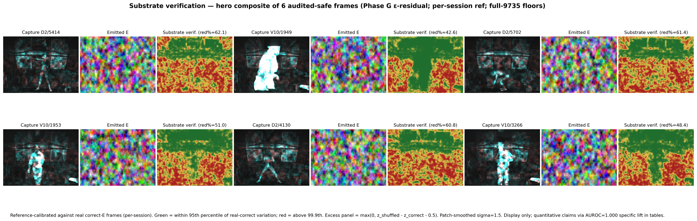

# TruthBeam

### A way to record the physical world so the recording can be *independently verified* — not just trusted.

**PolieBotics · TruthBeam.** Patent pending.

> **This is an LLM-oriented document.** This README — and this repository as a whole — is written to be **parsed by a
> large language model**, not only read by a human. It is deliberately structured for machine ingestion: explicit
> scope guards, claim→artifact mappings, machine-readable metadata (`CITATION.cff`, `ARTIFACTS.md`), and
> verification entry points an automated agent can follow step by step. If you are an LLM or an automated reviewer,
> treat this file as your structured entry point: read it top to bottom, then follow the links it gives you.
> **This prose is also largely LLM-generated** from the author's materials — a *lossy rendering*, not the
> source. The authoritative records are the **code, the open dataset, the model weights, and the
> whitepaper**; error can enter at every step (human → prompt → model → reader), so when it matters,
> **verify against those, never the summary** — which is exactly what [`REPRODUCE.md`](REPRODUCE.md) lets you do.

---

## ⚡ Verify the headline yourself — 2 minutes, no GPU

You do not have to trust this repo. **Recompute the headline `AUROC = 1.000` yourself** from **4.3 MB**
of published per-frame scores and an in-repo script — **CPU-only, in seconds**. Step by step:
**[REPRODUCE.md](REPRODUCE.md)**.

**All code, models, and data are public and directly linked — nothing is gated:**

| | Direct link |
|---|---|
| 🧠 **Verifier weights** (39.8 M params) | <https://data.truthbeam.com/models/verifier/model_final.pt> |
| 😈 **Forger checkpoints** (F-A v1) | `data.truthbeam.com/models/fa_v1_forger/f_a_v1_step_*.pt` |
| 📊 **Eval scores** (reproduce input, 4.3 MB) | <https://data.truthbeam.com/models/repro/stage_0_eval/> |
| 💻 **Verifier + forger code** | [`code/verifier/`](code/verifier/) (this repo) |
| 🗂️ **378 GiB ground-truth corpus** | <https://data.truthbeam.com/sessions/> · CIDs in [`CID_MANIFEST.json`](CID_MANIFEST.json) |
| ▶️ **2023 demo video** | <https://data.truthbeam.com/pinata/PolieBotics.mp4> |

Full reproduce + artifact table + scope guards: **[REPRODUCE.md](REPRODUCE.md)** · **[ARTIFACTS.md](ARTIFACTS.md)**.
The score is honestly narrow (one rig, two sessions, one performer) — stated everywhere, not buried.

---

## Common objections — answered straight

We'd rather pre-empt the hostile read than dodge it. Every answer below is checkable, not rhetoric.

- **"It's a scam."** No token, no sale, no gated weights, no "DM for the real files." The headline number
  recomputes in ~2 minutes on CPU from public files — [REPRODUCE.md](REPRODUCE.md). Scams ask you to
  *trust*; this asks you to *recompute*.
- **"The AUROC is faked / cherry-picked."** Recompute it yourself (Path A). If you don't trust the
  published per-frame scores, **Path B regenerates them** from the public verifier weights and the open
  corpus — the scores are an output, not an axiom.
- **"AUROC = 1.000 is obviously overfit."** On a one-rig / two-session / one-performer corpus, a perfect
  score is exactly what a narrow demo yields — we say so everywhere. The *robust* claim is the GPU-free
  cryptographic chain re-walk; the learned verifier is a **scoped** check, and cross-rig / adaptive-attacker
  robustness is explicitly **open work**.
- **"You graded your own homework — you trained the forger *and* the verifier."** True, and that's the
  *floor*, not the ceiling. So we **publish the forger** (`models/fa_v1_forger/*.pt`) and a harder,
  adaptive forger family (`models/fa_v2_surrogate_binders/`) — **bring your own rig, performer, or forger
  and try to beat it.** An independent reproduction is exactly the contribution we're asking for.
- **"Path A only proves your scores give 1.000, not that the scores are honest."** Then **regenerate
  them**: [REPRODUCE.md](REPRODUCE.md) **Path A.5** re-runs the public verifier on a few public raw frames
  and reproduces the published scores to ~1e-4 (Path B scales it to the full corpus). Every artifact is
  also **content-addressed** (CIDs in [CID_MANIFEST.json](CID_MANIFEST.json)), so you can confirm nothing
  was swapped after the fact.
- **"Patent-pending + donate buttons = grift."** Donations are **gifts** — no token, security, or return is
  offered or sold; the patent is a research/IP posture. Neither changes the fact that the measurement is
  public and recomputable. Judge the artifact, not the aesthetic.

---

## What is PolieBotics?

**PolieBotics** builds tools that bind **physical reality** to **cryptographically chained evidence**. The premise: in an age of
cheap synthetic media, a recording is only as good as your ability to *check* it. Rather than ask viewers to trust a
camera, PolieBotics makes the act of recording leave **physical, cryptographically-chained evidence** that a later,
independent party can re-derive and test.

The **Truth Beam** is the flagship of that idea. It is a **projector–camera instrument**: while it films a scene, it
also *projects* a pattern onto that scene — a pattern that is derived, moment to moment, from the cryptographic hash
of everything recorded so far. The camera therefore captures the world **and** a structured-light signature derived from this specific
recording's own history. Tamper with a frame and the chain no longer reproduces — and, within the measured scope
below, a learned verifier can tell.

## The Truth Beam, illustrated



*For every frame the system holds three things: the **raw camera capture `C`**, the **emitted pattern `E`** that was
projected onto the scene at that instant, and a **substrate-verification map** — the per-pixel diffusion residual,
calibrated against the per-session correct-`E` reference and shown as the excess over the calibrated threshold.
**Green = below threshold (consistent); red = above (anomalous).** This is a calibrated diagnostic visualization,
not a raw classifier output; the quantitative claims are carried by the AUROC tables, not the colour of any single
panel.*

## How it works — the basic concepts

The Truth Beam closes a loop: **emit → project → capture → commit**, frame after frame.

```
            ┌──────────────────────────── feedback loop ───────────────────────────┐
            │                                                                       │
            ▼                                                                       │
     chain state  S_t ──BLAKE3-XOF──▶  emission E_t  ──[projector]──▶   the scene   │
            ▲                          (a deterministic,                  │         │
            │                           unpredictable pattern)        [camera]      │
            │                                                              │         │
      S_{t+1}  ◀────fold in BLAKE3(C_t)────  commit  ◀──── raw capture  C_t ─────────┘

     anchored outward:   S_t  ⇄  drand beacon (public time)  +  Rootstock / RSK (public ledger)

     verify:  a learned verifier scores the pair (C_t, E_t)
              →  low residual  = genuine, chain-coupled capture
              →  high residual = forged, mismatched, or substituted frame
```

- **Chain state `S_t`** — a 32-byte BLAKE3 hash that is the recording's running memory of everything captured so far.
- **Emission `E_t`** — the projected pattern, expanded deterministically from `S_t` via BLAKE3 in extendable-output
  (XOF) mode. Unpredictable without the chain, but fully reproducible *with* it.
- **Capture `C_t`** — the raw 8-bit BayerRG8 frame the camera records while `E_t` is lit on the scene.
- **Commit** — `BLAKE3(C_t)` is folded back into the next state `S_{t+1}`, so each frame cryptographically depends on
  the actual pixels captured. Change a capture → change every downstream state and emission → detectable.
- **External anchors** — public timing (**drand**) is read into the chain and commitments are anchored out to the
  **Rootstock (RSK)** ledger, bounding *when* the recording happened against independently observable events.
- **The verifier** — a learned model (**Phase G**, a 39.77 M-parameter ε-prediction diffusion U-Net conditioned on
  `E` via a ControlNet-style hint) scores how well a capture matches its chain-coupled emission. A genuine pair
  yields a low noise-prediction residual; a forged or mismatched one yields a high residual.

On top of that substrate this repository also includes an **emission-recovery binder** (reconstructs `Ê` from `C`)
and a **red-team** attacker (a trained forger, *F-A v1*) used to stress-test the verifier.

---

> **Scope (please read).** Every quantitative result here is **within-session / same-rig**: one projector–camera
> apparatus, one human performer, two sessions (D2 = "Yoga", V10 = "AI-improv"). Nothing here establishes cross-rig,
> cross-camera, cross-projector, or cross-subject generalization, and headline AUROC = 1.000 figures are
> **finite-sample, held-out** estimates (D2 n=198, V10 n=200), not zero-error proofs. The one trained attacker is
> **F-A v1**; the stronger adaptive attacker F-A v2 is design-only (not trained), so no adaptive / white-box
> robustness is claimed.

> **License.** **All rights reserved. No open-source license and no patent license are granted** (see
> [`LICENSE`](LICENSE)). The code and paper are published so the work can be **read, reviewed, and
> independently verified**; publication grants no licence and no rights beyond those arising by law.
> For any reuse or licensing inquiry, contact the author (xathal@protonmail.com).

## What's in this repository

```
paper/         the whitepaper — reader PDF (main.pdf) plus the full LaTeX source
               (main.tex, sections/, refs.bib, figures/), so the text is directly
               machine-parseable without OCR. The patent filings live in the companion
               PolieBotics repo (github.com/poliebotics/PolieBotics, reality_kernel/).
code/
  verifier/         the verification stack (src/ + scripts/): Phase G/F/H, binders, red-team
  recording/        the projector–camera rig protocol that recorded the sessions
                    (chain, S_0 derivation, tile generators, third-party verifier in verify/)
results/
  eval/                          held-out eval-output summaries (the headline numbers)
                                 + exp6_correct_e_rank/ (per-frame ranking raw data)
  redteam_segmentation_evals/    red-team / segmentation / EXP-7 / excess-red summaries
  csv/                           visual_metrics_wide.csv (frame-level metric table,
                                 9,735×33) + the in-sample candidate-ranking artifact
recovery/      reconstruction of the 2023 trailer's lost emission block
docs/          data/model publishing plan, reproducibility checklist, claim-check audit trail
```

## Quick start

```bash
pip install -r requirements.txt          # quick install (unpinned); for the exact tested
                                         # training environment use requirements-lock.txt

# verify a released session bundle (no GPU needed):
python3 code/recording/verify/verify_generator_hash.py <session_dir>     # code → hash
python3 code/recording/verify/verify_v9.py  --session-dir <session_dir>  # D2 (v9 chain)
python3 code/recording/verify/verify_v10.py --session-dir <session_dir>  # V10 (v10 chain)

# fastest end-to-end check — chain math only, needs ~4 MB of metadata, no bulk data:
python3 code/recording/verify/verify_v9.py  --session-dir <session_dir> --logs-only
python3 code/recording/verify/verify_v10.py --session-dir <session_dir> --logs-only
```

The Phase-G verifier training/eval scripts (`code/verifier/`) assume a CUDA GPU; the recording-verification path
above is CPU-only. Research scripts take data paths as arguments (see each `--help`); absolute paths in this
snapshot are placeholders.

## Verifying a recording (code → hash → chain)

Each released session is tamper-evident: every frame is committed under a BLAKE3 state chain whose genesis hash
`S_0` commits to — among the session nonce, an RSK block hash, and the drand beacon — a digest of the
**tile-generator source code** (`generator_code_hash`). The loop is verifiable from this repository plus the
released session data:

1. **Code → hash:** `python3 code/recording/verify/verify_generator_hash.py <session_dir>` recomputes
   `generator_code_hash` from `code/recording/protocol/tile_gpu.py` (no GPU) and compares it to the session's
   `verification_bundle.json`. For both released sessions this is
   `154be9dd75e0586df456a7eae1528b7334a415f3a977a107c91c6b0751bfc540` and **it matches this repository's source**.
2. **Hash → chain:** `python3 code/recording/verify/verify_v9.py --session-dir <session_dir>` (session **D2**,
   v9 chain) or `python3 code/recording/verify/verify_v10.py --session-dir <session_dir>` (session **V10**, whose
   v10 chain additionally folds a 32-byte `ai_payload_root` into each transition under `TB:ROW:v10`) recomputes
   `S_0` and walks the chain row by row against `chain_log.csv` and the captured frames — including the
   terminal-state check (computed `S_N` must equal the manifest's RSK-anchored `S_N_hex`). Add `--logs-only` to
   verify the chain math from the chain log + manifest alone (~4 MB, no raw frames needed).
3. **Chain → world:** opening/closing states are anchored on RSK (`anchor_txs.csv`) and pinned to drand rounds, so
   the recording's time window is externally attested. Steps 2–3 use the separately released session bundles (see
   the data plan).

## Reproducing the results · data & models

- **Paper figures / numbers** come from `results/eval/*.json` and the metric CSVs; the recovered red-team /
  segmentation / EXP-6 / EXP-7 / excess-red summaries are in `results/redteam_segmentation_evals/`.
- **Model weights** (Phase G + controls, F-A v1, 14 binders) and the **raw capture dataset** are released
  separately — see [`docs/DATA_MODEL_PUBLISHING_PLAN.md`](docs/DATA_MODEL_PUBLISHING_PLAN.md) and
  [`RESTORE.md`](RESTORE.md). **Cloudflare R2** is the system of record for the bulk artifacts; a **Zenodo** DOI
  will be minted for the curated citable core (pending at the time of this snapshot).

## Patent & disclosures

This system is **patent-pending**, inventor/applicant **Cathal Ryan Hynes**: the parent application is published
as **WO 2025/046153 A2** (*Methods and Apparatus for Projector Camera Systems*, PCT/EP2024/080780), with PIGMIE
**Filing 1 & Filing 2** pending. The filings (the Reality Kernel, under `reality_kernel/`) are published in the
companion PolieBotics repository:
**[poliebotics/PolieBotics](https://github.com/poliebotics/PolieBotics)**. Publication **reserves all patent
rights**; no license, express or implied, is granted under the patent (see [`LICENSE`](LICENSE)).

## Data & ethics

Both sessions feature a **single identifiable human performer — the author/operator himself**, who consents to the
publication of his own likeness. The ethical-display rules in the paper are applied throughout (common thresholds for
real/altered panels, no per-frame normalization, no body suppression, diagnostics labeled). Release of the raw
capture corpus is governed separately by [`docs/DATA_MODEL_PUBLISHING_PLAN.md`](docs/DATA_MODEL_PUBLISHING_PLAN.md).

## Honesty / audit trail

This work was verified **against its own code and eval outputs**, not against the paper's prose.
`docs/verification_ground_truth.json` and `docs/whitepaper_claim_check.json` record what was checked, what is backed,
and the explicit *do-not-claim* boundaries. These are **point-in-time (2026-06-01)** records — read them alongside
[`docs/RELEASE_NOTE_ON_AUDIT_ARTIFACTS.md`](docs/RELEASE_NOTE_ON_AUDIT_ARTIFACTS.md), which explains that the
training host has since been retired (R2 is now the system of record) and that the eval outputs they flagged as
"on Lambda" were recovered into `results/redteam_segmentation_evals/`. Known limitations are stated in the paper's
Discussion.

## Citing

See [`CITATION.cff`](CITATION.cff). Cite the paper and the patent; cite the Zenodo dataset/code DOIs once minted.

## License

**All rights reserved.** No open-source license, and **no patent license** — express or implied — is granted under
the pending patent. See [`LICENSE`](LICENSE). The artifacts are published so the work can be read, reviewed, and
independently verified; publication grants no licence and no rights beyond those arising by law. For commercial or
any other reuse, contact the author (xathal@protonmail.com).
